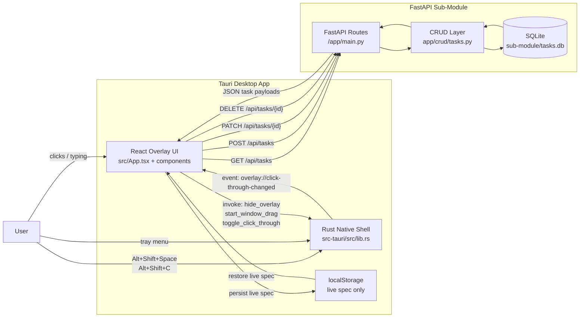

# Interaction Flow

This diagram shows how the overlay, native Tauri shell, and FastAPI sub-module
work together during local development.

## Notes

- Tasks are loaded and mutated through the FastAPI API.
- Live spec text is still local-only and stored in `localStorage`.
- Click-through is owned by Rust because the WebView cannot receive mouse input
  after cursor events are ignored.
- `make start` starts the backend in the background before launching Tauri.
